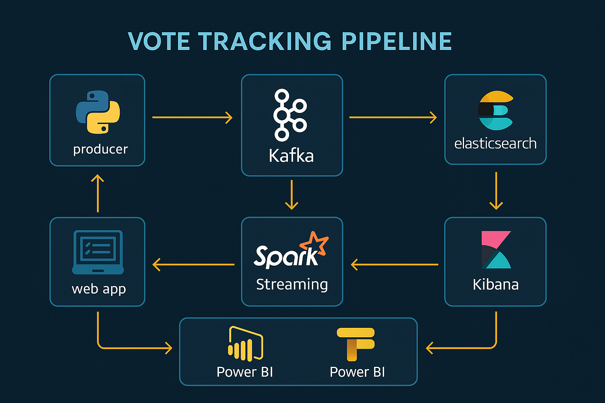

  

  
  
  
  
  
  

  
  
  

# 📊 VoteTracker-Pipeline

🚀 *VoteTracker-Pipeline* est une solution Big Data temps réel qui simule et analyse dynamiquement des votes électroniques à l’aide d’un pipeline de streaming moderne.

Elle repose sur une architecture distribuée combinant les meilleurs outils du moment : **Kafka**, **Spark**, **Elasticsearch**, **Kibana**, **Flask**, et **Docker**.

💡 Conçu comme un projet pédagogique avancé, ce pipeline traite automatiquement les flux entrants (votes simulés ou saisis manuellement), les structure, les indexe, puis les visualise en temps réel via un dashboard professionnel.

---

🔎 **Cas d’usage :**
> Suivi de vote en direct · Sondages interactifs · Retours utilisateurs · Monitoring d'événements en continu

🎯 **Ce que ce projet démontre :**
- Maîtrise des technologies Big Data temps réel
- Déploiement modulaire via Docker
- Traitement, stockage et visualisation de flux en direct

## 🎯 Objectifs du projet

Ce projet vise à concevoir et déployer un pipeline de données temps réel pour simuler des votes électroniques, avec les objectifs suivants :

- ⚙️ **Automatiser** la génération continue de votes toutes les 2 secondes
- 🧑‍💻 **Permettre la saisie manuelle** via une interface web simple et intuitive (Flask)
- ⚡ **Traiter les flux de données en direct** grâce à Apache Spark Structured Streaming
- 📦 **Indexer et stocker les résultats** dans Elasticsearch pour une consultation rapide
- 📊 **Visualiser les données en temps réel** via des dashboards interactifs Kibana
- 📤 **Exporter les données agrégées** vers Power BI pour une analyse complémentaire

---

💡 Ces objectifs reflètent les enjeux concrets du Big Data temps réel et démontrent l'intégration de technologies modernes de streaming dans une solution prête à l'emploi.

## 🧰 Stack Technique

| 🧩 Technologie          | 🔍 Rôle dans le pipeline                                             |
|------------------------|----------------------------------------------------------------------|
| **Python 3.10**        | Génération automatique de votes, export CSV, et interface Flask      |
| **Apache Kafka 3.6**   | Transmission distribuée des flux de votes via topic Kafka            |
| **Apache Spark 3.5.1** | Traitement temps réel structuré des données entrantes                |
| **Elasticsearch 8.11.2** | Indexation rapide et stockage structuré des résultats de vote     |
| **Kibana**             | Visualisation dynamique et interactive des résultats en temps réel   |
| **Docker + Compose**   | Déploiement conteneurisé et orchestration multi-services             |
| **Power BI**           | Analyse complémentaire des données exportées (CSV)                   |

---

💡 Chaque composant a été sélectionné pour sa robustesse, son intégration naturelle dans l'écosystème Big Data, et sa pertinence pour une solution temps réel évolutive.

## 🧱 Architecture (visual schema)

  

  

